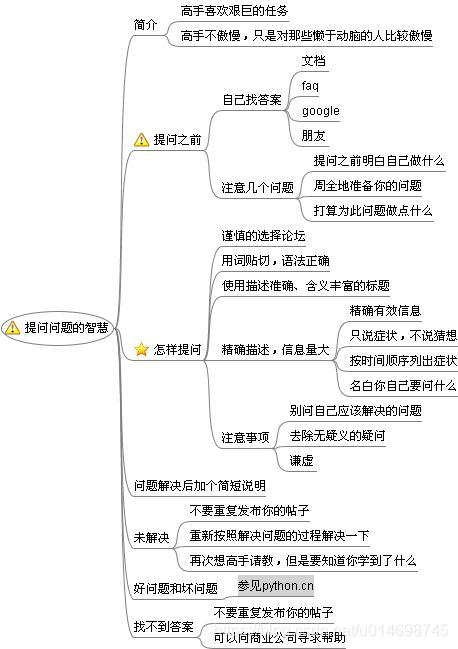

?> ❤️ 判断一个人，看他的回答不如看他所提出的问题 — 伏尔泰
>很多时候，一个人的能力，是体现在他能问出什么样的问题上的。
>
>提出问题是解决问题的第一步。

## 提问之前
先看个段子轻松下 : )
> Can I ask you a question? 
> 
> You just have.
> 
> 我能问你一个问题吗？
> 
> 你已经问过了。

这里，产生了一个微妙的无穷递归。为了不冒昧地提问，你首先问能否问一个问题；但是在问”能否问一个问题“的时候，你已经冒昧地提问了。


>提问之前的准备工作
- 是否尝试过自己解决这个问题？
- 是否尝试过在当前的`「忢问」`问答库、上网搜索，阅读手册文档以找到答案？
- 是否尝试请教身边的老同事/强者朋友解决？
- 是否清楚问题的来源和能否描述清楚问题？（把问题重现（复现）出来很重要）

当你提出问题的时候，请先表明你已经做了上述的努力；这将有助于树立你并不是一个不劳而获且浪费别人的时间的提问者。

如果你能一并表达在做了上述努力的过程中所学到的东西会更好，因为我们更乐于回答那些表现出能从答案中学习的人的问题。

准备好你的问题，再将问题仔细的思考过一遍，因为草率的发问只能得到草率的回答，或者根本得不到任何答案。

越是能表现出在寻求帮助前你为解决问题所付出的努力，你越有可能得到实质性的帮助。

## 怎样提问
- 问别人前先问问自己，提问之前的准备工作做好了么？
- 描述问题/需求的症状而非你的猜测/想象
- 话不在多而在精，去掉无意义的提问句
- 礼多人不怪，问题解决后，加个简单的补充说明（感谢和反馈问题的解决情况等等）

>偏技术型的提问艺术的思维导图参考



## 好问题，坏问题


```
************** 坏问题（没有意义的提问句+猜测和想象） *************
🤪：在？
🐵：我可以选择不在吗？
😀：能帮忙看个问题么？
🐵：啥问题，能说明白点么？......
🙂：游戏登录不上了？是不是我们SDK改了什么东西了？
🐵：怎么登录不上了？网络问题？WIFI还是移动网络？手机型号是多少.....能录个屏，截个图？
🙃：帮忙查个数据？单号是（后面跟了一张图片，图片的单号是一串很长的字符）
🐵：能复制一下单号？ ***

***************************** 好问题 ***************************
🤪：猿哥，我们的XX游戏登录不上了，我排除了我的手机网络问题，没有使用VPN代理，而且我们其他游戏在我手机上正常登录，下面是这个游戏的报错信息截图和录屏视频：......
🐵：好的，收到。
🐵：问题找到了，是游戏内的登录验证回调没接好。
🤪：好的，非常感谢，已经通知游戏那边处理好了，可以正常登录了。
```
?> 其实问题没有好坏之分，这里是为了形成对比，让大家更好的理解这其中的含义。在不同的角度看问题，问题是变化的，多换位思考，形成良好的习惯。

>关于看问题角度和思维认知，下面分享一个视频，希望诸君有所获。

<video src="http://mov.bn.netease.com/open-movie/nos/mp4/2020/10/12/SD5AUAM1S_3_shd.mp4" style="width: 46%;" controls="controls"></video>

```
视频提到的两个关于画画的例子挺有意思的：

1. 老师让小朋友们画一个水瓶，大部分人都是固定思维，从正面角度画的🍼，其实在不同的角度看都是水瓶，甚至是捏扁了的水瓶。
2. 台湾著名作家/画家/教育家刘墉当画画评委打分，外出写生画龙舟，几百幅画中只有一个学生画的龙舟是想象着龙舟从正面过来画的，其他学生都是从龙舟侧面横着画的。

里面一句话说的很好，角度对了，方向对了，方法技术好不好都叫风格。

黄执中：我们大多数对这个世界的认识，都是在一种妥协以及不追究的情况下所达成的结论。知道你不知道的才是真正知道的开始。
评论：大多数人对这个世界的认识，都是来源于父母，和身边的人，笼统的说来源于我们接收信息的能力，而信息来源于周围的环境。

世界上拥有最聪明脑瓜的人也说过类似的话：

我们能够观察并阐述理论，但我们绝不会知道真相，我们只能不断接近。 — 爱因斯坦
我们对99%的事物的了解，远不到1%。 — 爱迪生

```

## 关于教育
>中国家长：你今天在学校乖不乖啊？ 
> 
>以色列（犹太人）家长：今天有没有问老师回答不出的问题？今天有没有做什么让老师印象深刻的事情？

众所周知，犹太人是一个智商很高的民族，他们的教育方式也值得我们参考和学习。


```爱因斯坦的教育观
我在我的老师手里遭受了同样的待遇。因为我的独立，他们不喜欢我。当他们需要助教的时候，他们没有选择我。

世界上已经有太多的教育，特别是在美国的学校里面。

教育的唯一理性的方式是自己做一个榜样——如果实在不行，你可以做一个反例。

教一个人专业知识是不够的。通过专业知识，他可以变成一个有用的机器，但却不具有和谐的人格。

过分强调竞争，过早的功利化和专业化，可以杀灭所有文化生活所赖以生存的精神。

独立的，批判性的思维，必须从小培养。过度的，过于多样化的科目（分数制度）会破坏这种思维的发展。

教育应该是这样：被传授的知识应该被当成宝贵的礼物，而不是沉重的任务。
```

>[这里是个关于批判性思维视频课程分享](http://open.163.com/newview/movie/courseintro?newurl=%2Fspecial%2Fcuvocw%2Fpipanxingsiwei.html)  有兴趣的可以点开看看 : )

## 关于编程
>软件开发中编码是个次要问题，理清业务逻辑的小节骨眼才是难点和乐趣所在。
>
>《编程珠玑》开篇也强调准确的问题描述的重要性：“问题的定义要占这场战役的90%左右”。有意识的去细化、分解问题，形成习惯后就很受用。
